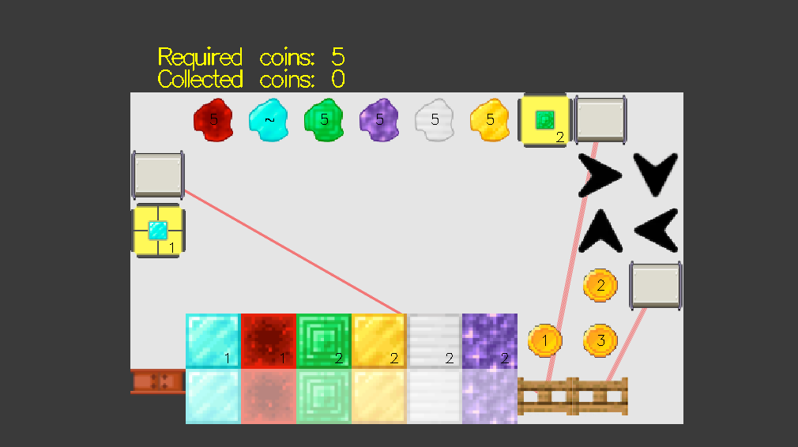

<h1>Colorban</h1>

Game project for course Functional Programming 2023

In Colorban, puzzles can include multiple robots and the goal is to collect enough coins to win. Players navigate through colored blocks, gate controls, and directional tiles, guiding robots strategically to gather coins while clearing same-colored blocks to progress through levels.

